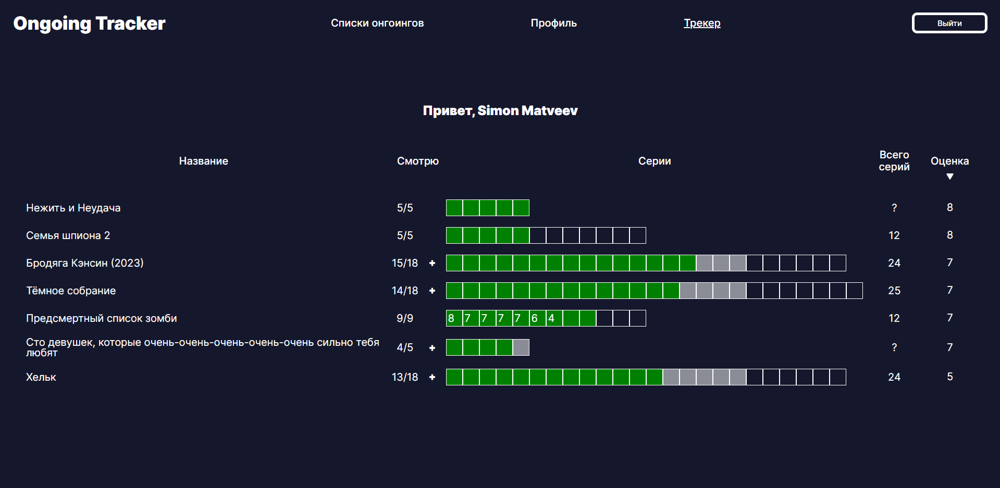
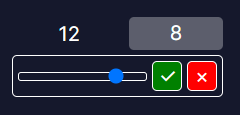
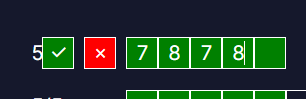
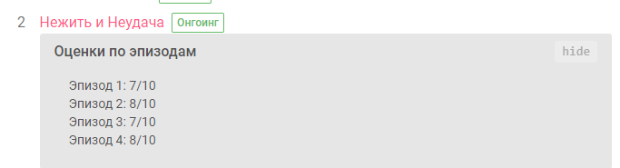
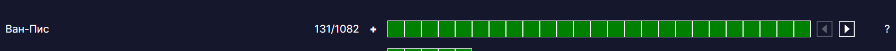

# Приложение `Ongoing Tracker`

## Описание
Репозиторий для приложения `Ongoing Tracker`. Приложение позволяет удобно отслеживать и оценивать сезонные аниме (далее - онгоинги). Приложение использует API сайта **Shikimori.one**. После авторизации с помощью аккаунта Shikimori предоставляет следующие функции:

<details>
  <summary><b>Общий вид сайта</b></summary>
  
  
</details>
<br>

1. Отслеживание онгоингов в реальном времени в виде наглядной таблицы - зелёным отображаются просмотренные эпизоды, серым - вышедшие, но еще не просмотренные, без цвета - общее количество серий. В случае, если общее количество серий пока неизвестно, отображаются только уже вышедшие эпизоды.

2. Отмечание просмотренных серий (кнопка '+'). 

3. Выставление общей оценки онгоингу (нажатием на оценку).
<br><br>

4. Выставление оценок каждой из серий. После сохранения у соответсвующего онгоинга автоматически формируется комментарий с выставленными оценками. Для аниме длиннее 25 эпизодов появляется горизонтальная прокрутка серий.
<br><br>

<br><br>
Для аниме длиннее 25 эпизодов появляется горизонтальная прокрутка серий.
<br><br>


5. По нажатию на название осуществляется редирект на страницу онгоинга на Shikimori.

6. Реализована сортировка по всем столбцам, настройки сохраняются в localStorage. 

## Стек технологий

HTML, JS, CSS, TS, React.
  
## Запуск проекта 

1. Так как приложение авторизует пользователя через OAuth. Требуется настроить соответствующее приложение на сайте Shikimori. По умолчанию трекер подключен к соответсвующему приложению, осуществляющему редирект на **localhost:3000**, но для использования в продакшне необходимо создать новое приложение по [адресу](https://shikimori.one/oauth/applications) и указать в настройках Redirect URI как **url_сайта/redirect**, в скоупе отметить **user_rates**. После этого в файле src/utils/constants.ts следует указать соответствующие **CLIENT_ID**, **CLIENT_SECRET**, **REDIRECT_URI** и **USER_AGENT**.

2. Для обоих частей приложения:
```
npm install
npm run start - dev сервер
npm run build - билд для продакшна
```

## Планы на будущее

- [ ] Рефакторинг разметки для адаптивности.
- [ ] Страница профиля.
- [ ] Страница со всеми онгоингами сезона, с возможностью добавлять их в раздел 'Смотрю'.